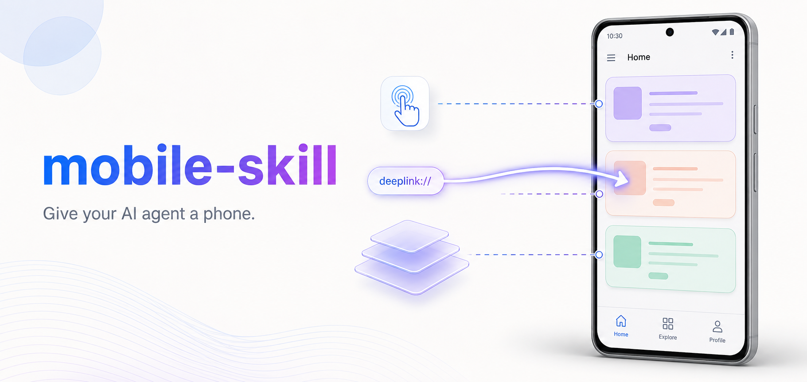
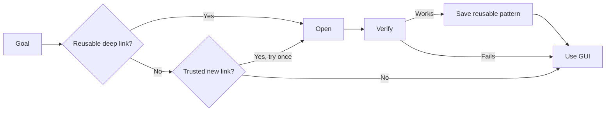

<div align="center">
  
  <br>
  <br>
  <strong>Give your AI agent a real Android phone.</strong>
  <br>
  <sub>Screenshot-grounded Android control with deep-link acceleration and explicit safety boundaries.</sub>
  <br>
  <br>
  <a href="LICENSE"></a>
  
  
</div>

`mobile-skill` lets AI agents operate a USB-connected Android phone. The agent opens each screenshot, reasons about the visible UI, performs one atomic action, and verifies the result before continuing.

When a reliable [deep link](https://developer.android.com/training/app-links/deep-linking) is available, the agent can jump directly to a stable destination such as search, a video, or a profile. Otherwise it falls back to screenshot-driven taps, swipes, typing, and navigation.

## Why mobile-skill

- **Agent-native setup.** Give your coding agent one instruction. It installs the Skill, prepares the CLI, runs diagnostics, and reports what needs attention.
- **Grounded real-device control.** The agent operates a USB-connected Android phone through screenshots and atomic actions. Observations expire after use to prevent stale-screen clicks.
- **A deep-link registry that improves with use.** Reliable routes skip repetitive navigation. Observed invocations become reusable structural templates, while unknown destinations fall back to visual control.

## Quick Start

### 1. Prepare the phone

You need:
- Python 3.11+
- Android platform-tools with `adb` on `PATH`
- An unlocked Android phone connected over USB with USB debugging enabled

### 2. Ask your agent to install it

Paste this into Codex, Claude Code, or another shell-capable coding agent:

```text
Clone https://github.com/gpengzhi/mobile-skill.git and follow AGENT_INSTALL.md.
```

The agent creates an isolated environment, installs the Skill and `msk` launcher, then runs `doctor`. If Android authorization is missing, it asks you to unlock the phone and accept the USB debugging dialog.

### 3. Describe a goal

```text
Use mobile-skill to open Bilibili, search for Minecraft, sort results by view count, and filter to the past week. Pick a video, like it, save it. Open its comments, sort by time, like the top one, and reply 'haha' with a smiley emoji.
```

The request authorizes only the stated actions. Sending, posting, purchasing, deleting, liking, following, or changing important settings requires explicit user authorization.

## How It Works



The core loop is deliberately atomic:

```bash
msk --json session start
msk --json observe --session <id>
msk --json tap 500 500 --session <id> --observation <obs-id> --observe-after
msk --json session stop <id>
```

Coordinates use a normalized `0..999` space, so the agent's actions remain independent of the physical screen resolution.

## Deep Links That Learn

The built-in registry currently contains **25 templates across 9 Android apps**: Bilibili, Zhihu, Kuaishou, Taobao, Xianyu, Amap, Weibo, Alipay, and WeChat.

```bash
msk --json app registry tv.danmaku.bili
msk --json app open-url "bilibili://search?keyword=Minecraft" \
  --session <id> --observe-after
```

When the agent uses a complete deep link from a reliable source, mobile-skill saves its route shape instead of the specific value:

```text
bilibili://space/12345678
              ↓
bilibili://space/{...}
```

Here, the profile ID becomes a placeholder. Later sessions can find this template in the local registry and insert another profile ID. The registry also tracks whether past attempts opened the expected app.

This learning happens through normal use. The agent does not guess, enumerate, or fuzz routes. It still checks the screenshot after every deep link because opening the expected app does not guarantee the expected page. If a route is unavailable or fails verification, the agent continues with GUI navigation.

See [`registry/deeplinks.json`](registry/deeplinks.json) for the curated registry.

## Supported Environments

Built-in installation profiles are available for:

`Codex` · `Claude Code` · `Cursor` · `OpenClaw` · `CodeBuddy` · `WorkBuddy` · `Pi` · `Hermes` · `Kimi Code`

Every environment still needs:

- shell access to run `msk`
- a vision-capable model
- a host tool that can open the local screenshot path returned by `observe`

Run `msk doctor --agent <name>` to verify the CLI, Skill path, device, screenshot capture, and text-input capabilities. Static diagnostics report vision as `unverified`. Only a real visual task can prove the model opened and understood the image.

## Current Limits

- Android only. iOS is not supported.
- USB ADB only. Wi-Fi pairing is not supported yet.
- One active Session per device. Use `--device` when several phones are connected.
- No OCR, accessibility tree, UIAutomator tree, or element selectors
- Visual precision depends on the model and screenshot resolution

## Project references:

- [`AGENT_INSTALL.md`](AGENT_INSTALL.md) — Agent-driven installation workflow
- [`skill/SKILL.md`](skill/SKILL.md) — runtime behavior and safety contract
- [`docs/project-plan.md`](docs/project-plan.md) — architecture, invariants, and roadmap
- [`registry/deeplinks.json`](registry/deeplinks.json) — curated deep-link templates
